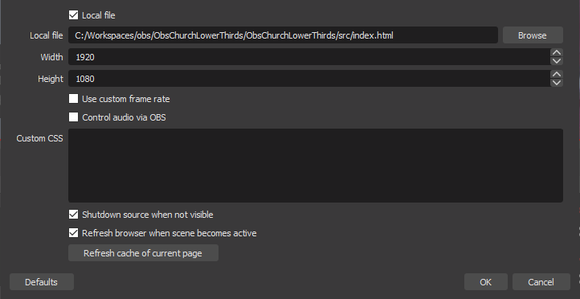

# ObsChurchLowerThirds

## Description

This is a browser based plugin for OBS Studio. This plugin is intended to be used by churches that live stream their services and would like a countdown before it starts.  Once setup, this plugin will auto-magically display a countdown and lower-thirds when transitioned to the live window so your volunteers do not have to mess with text files or LUA scripts like other plugins.  Instead, this plugin will calculate the next service date, time, and title based on configuration and the system date/time.

Tested on Windows and not sure of MacOs compatibility.

## Installation

1. Extract the .zip file to a known location.
2. In OBS, add a new __Browser Source__ to the scene.
3. In the browser source properties window:
   * choose Local file
   * browse to the __index.html__ file extracted earlier
   * set the Width and Height to match your output resolution
   * IMPORTANT: make sure __Refresh browser when scene becomes active__ is checked



## Configuration

Configure the plugin by modifying the `services` array found in the file `./src/js/site.js`. Each of the `services` array items have the following properties:

* __title__. Title of the event which will display on the top line of the lower-thirds.
* __day__. Day of the week. 0=Sunday, 1=Monday, etc.
* __hours__. An integer between 0 and 23 (for example, an event at 6:00 PM would require `18` in the hours property)
* __minutes__. An integer between 0 and 59.

Example Configuration:
```javascript
const services = Object.freeze([
    { title: "Sunday Morning Worship", day: 0, hours: 10, minutes: 30 }, // Sundays at 10:30 AM
    { title: "Sunday Evening Bible Study", day: 0, hours: 18, minutes: 0 }, // Sundays at 6:00 PM
    { title: "Wednesday Bible Study", day: 3, hours: 18, minutes: 30 } // Wednesdays at 6:30 PM
]);
```